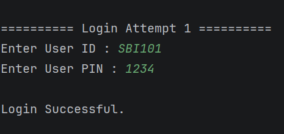
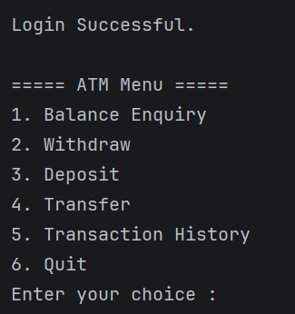
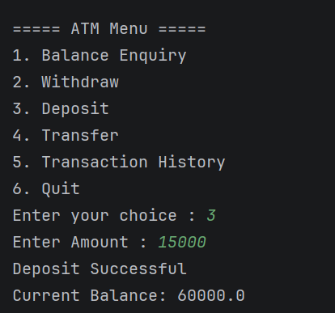
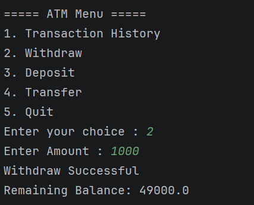
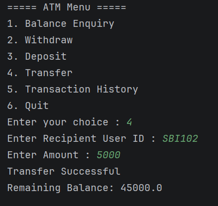
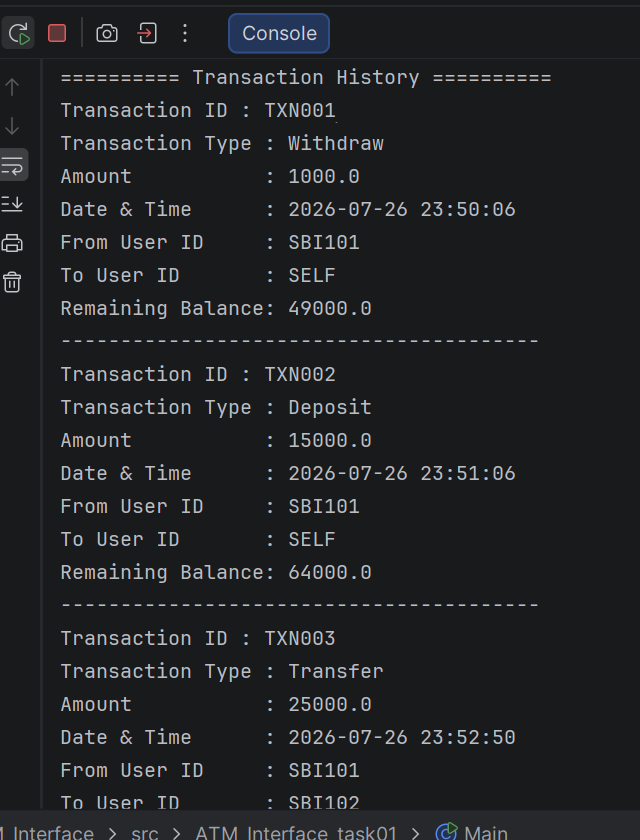
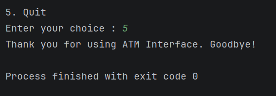

# ATM Interface

## 📌 Project Overview

The ATM Interface is a Java console-based application developed as part of the OASIS Infobyte Java Development
Internship.

The project simulates the basic operations performed in an Automated Teller Machine (ATM). It follows Object-Oriented
Programming (OOP) principles and provides a menu-driven interface for users to perform banking operations securely.

---

## 🎯 Objective

To design and develop a console-based ATM application that allows users to perform banking transactions such as:

- Login using User ID and PIN
- Balance Enquiry
- Deposit Money
- Withdraw Money
- Transfer Money
- View Transaction History
- Quit the Application

---

## 🛠️ Technologies Used

- Java
- IntelliJ IDEA
- Object-Oriented Programming (OOP)
- ArrayList
- Scanner Class
- Git
- GitHub

---

## 📂 Project Structure

```
ATM_Interface
│
├── Main.java
├── ATM.java
├── Bank.java
├── Account.java
└── Transaction.java
```

---

## ✨ Features

- Secure Login using User ID and PIN
- Maximum 3 Login Attempts
- Deposit Money
- Withdraw Money
- Transfer Money
- Transaction History
- Balance Validation
- User-Friendly Error Messages
- Menu-Driven Interface
- Object-Oriented Design

---

## 🏗️ Class Responsibilities

### Main

- Entry point of the application
- Controls the application flow

### ATM

- Accepts user input
- Displays menu and responses

### Bank

- Authenticates users
- Coordinates banking operations
- Searches accounts
- Processes transactions

### Account

- Stores customer information
- Manages PIN verification
- Maintains account balance
- Performs deposit and withdrawal operations

### Transaction

- Records all transactions
- Displays transaction history

---

## ▶️ How to Run

1. Open the project in IntelliJ IDEA.
2. Compile the project.
3. Run `Main.java`.
4. Enter a valid User ID and PIN.
5. Select the required operation from the menu.

---

## 🧪 Sample Test Credentials

| User ID | PIN  | Status   |
|---------|------|----------|
| SBI101  | 1234 | Active   |
| SBI102  | 2222 | Active   |
| SBI103  | 3333 | Inactive |

---

## 📖 Concepts Used

- Classes & Objects
- Constructors
- Encapsulation
- Access Modifiers
- Loops
- Conditional Statements
- ArrayList
- Method Calling
- Object Communication
- Exception-safe Input Handling

---

## 🚀 Future Enhancements

- Database Integration (MySQL)
- GUI using Java Swing or JavaFX
- OTP Authentication
- Mini Statement Printing
- Interest Calculation
- Admin Panel
- File-Based Data Storage

---

## 👨‍💻 Author

**Sourabh Udaykumar Yadwad**

Java Full Stack Developer (Learner)

Developed as part of the **OASIS Infobyte Java Development Internship**.

---

## 📷 Application Screenshots

### Login Screen



### ATM Main Menu 


### Balance Enquiry 


### Deposit 


### Withdraw 


### Transfer 


### Transaction History 


### Quit 

